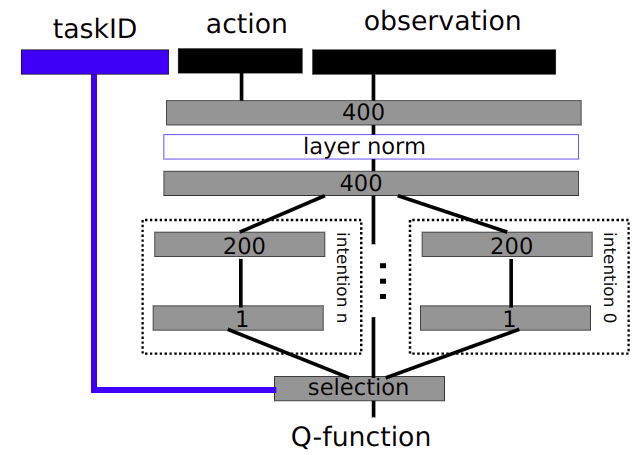
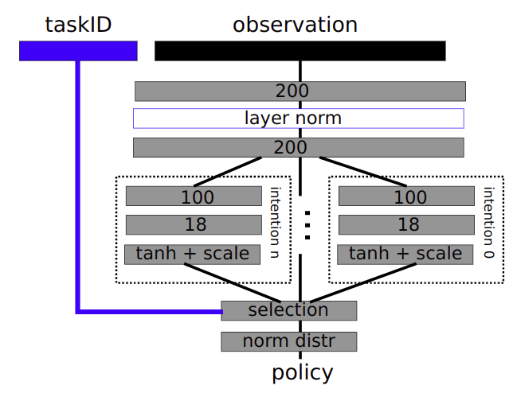

# PySACX

This repo contains a Pytorch implementation of the SAC-X RL Algorithm [1]. It uses the continuous Lunar
Lander environment from OpenAI gym. The SAC-X algorithm enables learning of complex behaviors from scratch
in the presence of multiple sparse reward signals.
 
## Theory

In addition to a main task reward, we define a series of auxiliary rewards. An important assumption is that
each auxiliary reward can be evaluated at any state action pair. The rewards are defined as follows:

*Auxiliary Tasks/Rewards*
 - Touch. Maximizing number of legs touching ground
 - Hover Planar. Minimize the planar movement of the lander craft
 - Hover Angular. Minimize the rotational movement of the lander craft
 - Upright. Minimize the angle of the lander craft
 - Goal Distance. Minimize distance between lander craft and pad

*Main Task/Reward*
 - Did the lander land successfully (Sparse reward based on landing success)
 
Each of these tasks (intentions in the paper) has a specific model head within the neural nets used
to estimate the actor and critic functions. When executing a trajectory during training, the task (and 
subsequently the model head within the actor) is switched between the different available options.
This switching can either be done randomly (SAC-U) or it can be learned (SAC-Q).

The pictures below show the network architechtures for the actor and critic functions. Note the _N_
possible heads for _N_ possible tasks (intentions in the paper) [1].

*Learning*

Learning the actor (policy function) is done off-policy using a gradient based approach. Gradients are
backpropagated through task-specific versions of the actor by using the task-specific versions of the 
critic (Q function). Importantly though, the trajectory (collection of state action pairs) need not
have been collected using the same task-specific actor, allowing learning from data generated by all other actors.
The actor policy gradient is computed using the reparameterization trick (code in `model.py`)

Learning the critic (Q function) is similarly done off-policy. We sample trajectories from a buffer
collected with target actors (actor policies frozen at a particular learning iteration). The critic
policy gradient is computed using the retrace method (code in `model.py`)

   
## Results

TBA
 
## Instructions

- Use `train.py` to train an agent.
 
## Requirements

- Python 3.6
- [PyTorch](http://pytorch.org/) 0.3.0.post4
- [OpenAI Gym](https://gym.openai.com/)
- [tensorboardX](https://github.com/lanpa/tensorboard-pytorch/tree/master/tensorboardX)

## Sources

[1] [Learning by Playing – Solving Sparse Reward Tasks from Scratch](https://arxiv.org/abs/1802.10567).